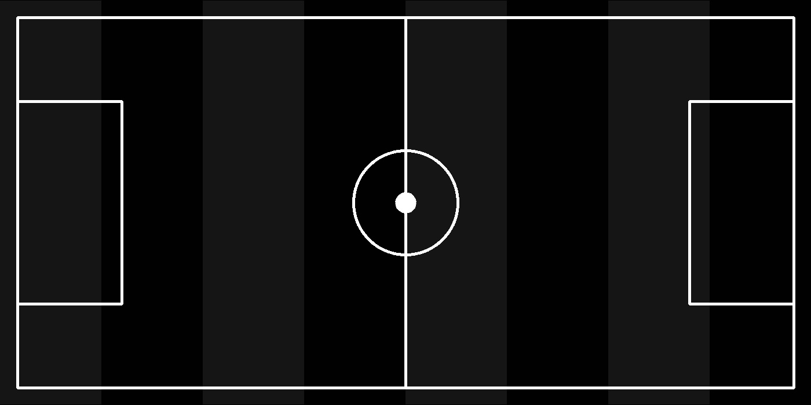

# Cat Detector
It can to read an image and count number of cat
## How to install
Run following commend:
```
pip install -r requirements.txt
```
## How to Run
execute this commend in terminal:
```
python cat_detect.py
```
## result


# Football Ground
It's make a football ground.
##  How to install
Run following commend:
```
pip install -r requirements.txt
```
## How to Run
execute this commend in terminal:
```
python football.py
```
## result

# face editer 
it's to put on your face some **edit**.
## How to install
Run following commend:
```
pip install -r requirements.txt
```
## How to Run
execute this commend in terminal:
```
python face_editer.py
```
## result
