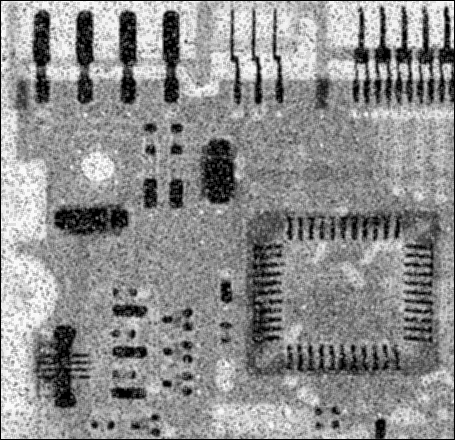
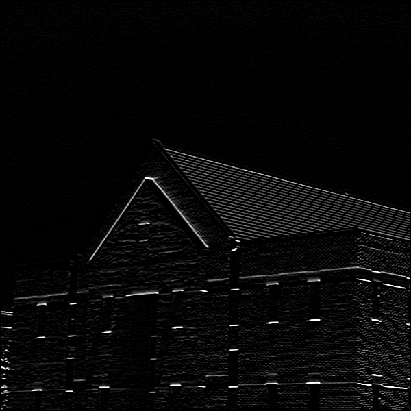
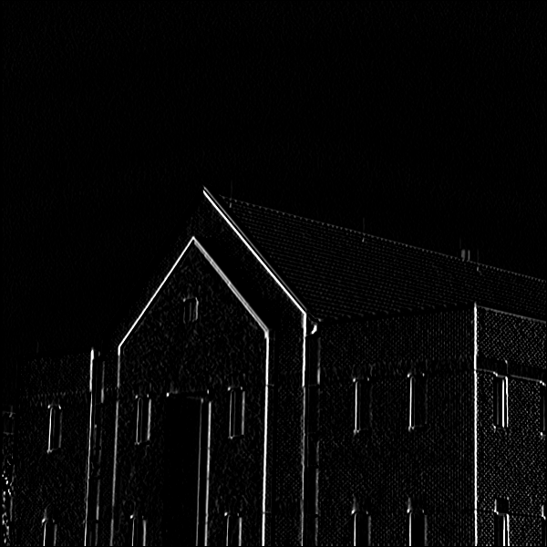

# Histogram
## How to install
Run following commend:
```
pip install equirements.txt
```
 ## How to Run
 execute this commend to terminal:
 ```
 python histogram.py
 ```
Write a function to get an image as input argument then calculate histogram and return it. 

# background blur
A ***blurred background*** draws the focus to what’s important. It also often plays a part in differentiating the professional portrait 😍 from the casual snapshot 😐.
Focus on the flower and blue the background.
## How to install
Run following commend:
```
pip install equirements.txt
```
 ## How to Run
 execute this commend to terminal:
 ```
 python background_blur.py
 ```
 ## Result
 
 # Edge detection 
Use Laplacian Operator to detect edges of image.
## How to install
Run following commend:
```
pip install equirements.txt
```
 ## How to Run
 execute this commend to terminal:
 ```
 python Edge detection.py
 ```
 ## Result


# delete noise
Mean filtering is a simple and easy to implement method of smoothing images. It is often used to reduce noise in images. The mean filter is computed using a convolution. The idea of mean filtering is simply to replace each pixel value in an image with the mean (average) value of its neighbors, including itself. Often a 3×3 square kernel is used, although larger kernels (e.g. 5×5 squares) can be used for more severe smoothing.


if it's 5*5, make more bluring the image.
## How to install
Run following commend:
```
pip install equirements.txt
```
 ## How to Run
 execute this commend to terminal:
 ```
 python de_noise.py
 ```
 ## Result


# building
Use A suitable kernel to detect vertical and horizontal edges of image.
## How to install
Run following commend:
```
pip install equirements.txt
```
 ## How to Run
 execute this commend to terminal:
 ```
 python de_noise.py
 ```
 ## Result
 
 